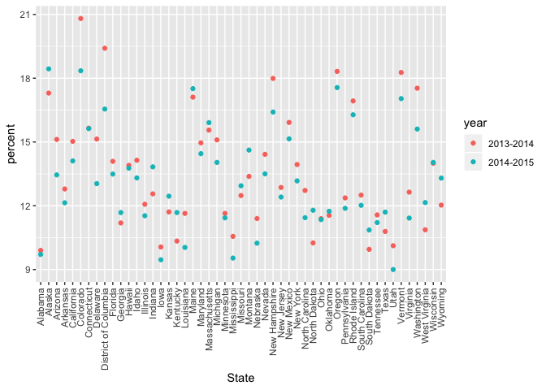
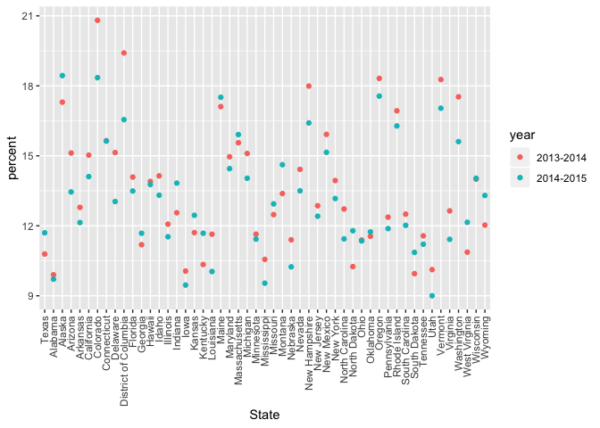
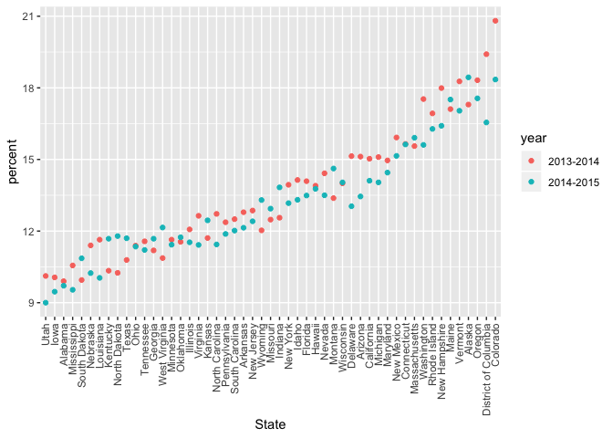

strings and factors
================
Seonyoung Park (sp3804)
11/1/2020

## Strings and regex

  - str\_detect(string, “pattern”); pattern is Case-upper, lower
    case-specific
  - str\_replace(string, “pattern”, “new string”)

<!-- end list -->

``` r
string_vec = c("my", "name", "is", "jeff")

str_detect(string_vec, "jeff")
```

    ## [1] FALSE FALSE FALSE  TRUE

``` r
str_replace(string_vec, "jeff", "Jeff")
```

    ## [1] "my"   "name" "is"   "Jeff"

  - “^i think” begining of the line
  - “i think$” end of the line

<!-- end list -->

``` r
string_vec = c(
  "i think we all rule for participating",
  "i think i have been caught",
  "i think this will be quite fun actually",
  "it will be fun, i think"
  )

str_detect(string_vec, "^i think")
```

    ## [1]  TRUE  TRUE  TRUE FALSE

``` r
str_detect(string_vec, "i think$")
```

    ## [1] FALSE FALSE FALSE  TRUE

  - 
<!-- end list -->

``` r
string_vec = c(
  "Y'all remember Pres. HW Bush?",
  "I saw a green bush",
  "BBQ and Bushwalking at Molonglo Gorge",
  "BUSH -- LIVE IN CONCERT!!"
  )
str_detect(string_vec,"bush")
```

    ## [1] FALSE  TRUE FALSE FALSE

``` r
str_detect(string_vec,"Bush")
```

    ## [1]  TRUE FALSE  TRUE FALSE

``` r
str_detect(string_vec,"[Bb]ush")
```

    ## [1]  TRUE  TRUE  TRUE FALSE

  - \[0-9\]\[a-zA-Z\]: number first followed immediately by letter

<!-- end list -->

``` r
string_vec = c(
  '7th inning stretch',
  '1st half soon to begin. Texas won the toss.',
  'she is 5 feet 4 inches tall',
  '3AM - cant sleep :('
  )

str_detect(string_vec, "^[0-9][a-zA-Z]")
```

    ## [1]  TRUE  TRUE FALSE  TRUE

  - “.”; match with literally anything
  - 7.11= 7x11 (x can be anything)
  - to detect exact 7.11, we have to put “7\\.11”

<!-- end list -->

``` r
string_vec = c(
  'Its 7:11 in the evening',
  'want to go to 7-11?',
  'my flight is AA711',
  'NetBios: scanning ip 203.167.114.66'
  )

str_detect(string_vec, "7.11")
```

    ## [1]  TRUE  TRUE FALSE  TRUE

``` r
str_detect(string_vec, "7\\.11")
```

    ## [1] FALSE FALSE FALSE  TRUE

  - detect open bracket

<!-- end list -->

``` r
string_vec = c(
  'The CI is [2, 5]',
  ':-]',
  ':-[',
  'I found the answer on pages [6-7]'
  )

str_detect(string_vec, "\\[")
```

    ## [1]  TRUE FALSE  TRUE  TRUE

## Factors

  - we can see which one is reference (assumed as “1”)

<!-- end list -->

``` r
vec_sex = factor(c("male", "male", "female", "female"))
vec_sex
```

    ## [1] male   male   female female
    ## Levels: female male

``` r
as.numeric(vec_sex)
```

    ## [1] 2 2 1 1

what happens if I relevel…(switch male into reference)

``` r
vec_sex = fct_relevel(vec_sex,"male")
vec_sex
```

    ## [1] male   male   female female
    ## Levels: male female

``` r
as.numeric(vec_sex)
```

    ## [1] 1 1 2 2

## NSDUH - strings

``` r
url = "http://samhda.s3-us-gov-west-1.amazonaws.com/s3fs-public/field-uploads/2k15StateFiles/NSDUHsaeShortTermCHG2015.htm"
drug_use_html = read_html(url)


table_mar = 
  read_html(url) %>%
  html_nodes(css = "table") %>%
  first() %>%
  html_table %>%
  slice(-1) %>%
  as_tibble()

table_mar
```

    ## # A tibble: 56 x 16
    ##    State `12+(2013-2014)` `12+(2014-2015)` `12+(P Value)` `12-17(2013-201…
    ##    <chr> <chr>            <chr>            <chr>          <chr>           
    ##  1 Tota… 12.90a           13.36            0.002          13.28b          
    ##  2 Nort… 13.88a           14.66            0.005          13.98           
    ##  3 Midw… 12.40b           12.76            0.082          12.45           
    ##  4 South 11.24a           11.64            0.029          12.02           
    ##  5 West  15.27            15.62            0.262          15.53a          
    ##  6 Alab… 9.98             9.60             0.426          9.90            
    ##  7 Alas… 19.60a           21.92            0.010          17.30           
    ##  8 Ariz… 13.69            13.12            0.364          15.12           
    ##  9 Arka… 11.37            11.59            0.678          12.79           
    ## 10 Cali… 14.49            15.25            0.103          15.03           
    ## # … with 46 more rows, and 11 more variables: `12-17(2014-2015)` <chr>,
    ## #   `12-17(P Value)` <chr>, `18-25(2013-2014)` <chr>, `18-25(2014-2015)` <chr>,
    ## #   `18-25(P Value)` <chr>, `26+(2013-2014)` <chr>, `26+(2014-2015)` <chr>,
    ## #   `26+(P Value)` <chr>, `18+(2013-2014)` <chr>, `18+(2014-2015)` <chr>,
    ## #   `18+(P Value)` <chr>

1.  Remove P-value column
2.  pivot: except for the State column, make pivot
3.  age\_year; separate age and years by open parenthesis (“\\(”)
4.  year: remove close parenthesis by replacing with nothing ""
5.  percent; remove letter by replacing with nothing "", then change it
    as numeric.
6.  filter state (not Total U.S. Northeast, Midwest, South, or West)

<!-- end list -->

``` r
data_mar=
  table_mar %>%
  select(-contains("P value")) %>%
  pivot_longer(
    -State,
    names_to = "age_year",
    values_to =  "percent"
  ) %>%
  separate(age_year, into = c("age", "year"), sep="\\(")%>%
  mutate(
    year = str_replace(year, "\\)", ""),
    percent = str_replace(percent, "[a-c]$", ""),
    percent = as.numeric(percent)
  ) %>% 
  filter(!(State%in% c("Total U.S.", "Northeast", "Midwest", "South", "West")))

data_mar
```

    ## # A tibble: 510 x 4
    ##    State   age   year      percent
    ##    <chr>   <chr> <chr>       <dbl>
    ##  1 Alabama 12+   2013-2014    9.98
    ##  2 Alabama 12+   2014-2015    9.6 
    ##  3 Alabama 12-17 2013-2014    9.9 
    ##  4 Alabama 12-17 2014-2015    9.71
    ##  5 Alabama 18-25 2013-2014   27.0 
    ##  6 Alabama 18-25 2014-2015   26.1 
    ##  7 Alabama 26+   2013-2014    7.1 
    ##  8 Alabama 26+   2014-2015    6.81
    ##  9 Alabama 18+   2013-2014    9.99
    ## 10 Alabama 18+   2014-2015    9.59
    ## # … with 500 more rows

## NSDUH - factors; to plot (by relevel or reorder of category), linear regression etc.

``` r
data_mar  %>%
  filter(age=="12-17")
```

    ## # A tibble: 102 x 4
    ##    State      age   year      percent
    ##    <chr>      <chr> <chr>       <dbl>
    ##  1 Alabama    12-17 2013-2014    9.9 
    ##  2 Alabama    12-17 2014-2015    9.71
    ##  3 Alaska     12-17 2013-2014   17.3 
    ##  4 Alaska     12-17 2014-2015   18.4 
    ##  5 Arizona    12-17 2013-2014   15.1 
    ##  6 Arizona    12-17 2014-2015   13.4 
    ##  7 Arkansas   12-17 2013-2014   12.8 
    ##  8 Arkansas   12-17 2014-2015   12.1 
    ##  9 California 12-17 2013-2014   15.0 
    ## 10 California 12-17 2014-2015   14.1 
    ## # … with 92 more rows

Make a plot x=state, y=percent, color = year \* State is character;
alphabetical order when plotting

``` r
data_mar  %>%
  filter(age=="12-17") %>%
  ggplot(aes(State,y=percent,color=year)) +
  geom_point() + theme(axis.text.x=element_text(angle = 90, vjust = 0.5, hjust=1))
```

<!-- -->

Let’s change State into factor 1. fct\_relevel; with Texas as the very
first one. 2. fct\_reorder; in order of percent ranking (from lowest to
highest)

``` r
data_mar  %>%
  filter(age=="12-17") %>%
  mutate(State= fct_relevel(State, "Texas")) %>%
  ggplot(aes(State,y=percent,color=year)) +
  geom_point() + theme(axis.text.x=element_text(angle = 90, vjust = 0.5, hjust=1))
```

<!-- -->

``` r
data_mar  %>%
  filter(age=="12-17") %>%
  mutate(State= fct_reorder(State, percent)) %>%
  ggplot(aes(State,y=percent,color=year)) +
  geom_point() + theme(axis.text.x=element_text(angle = 90, vjust = 0.5, hjust=1))
```

<!-- -->
